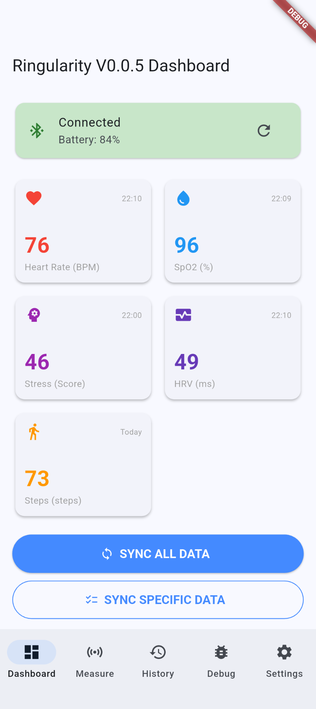
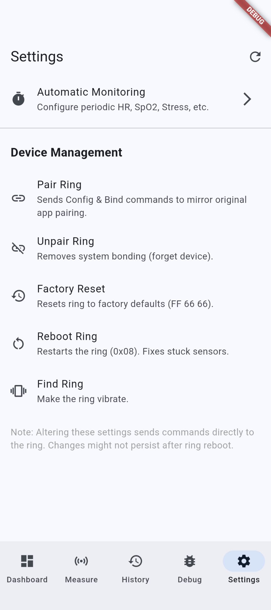
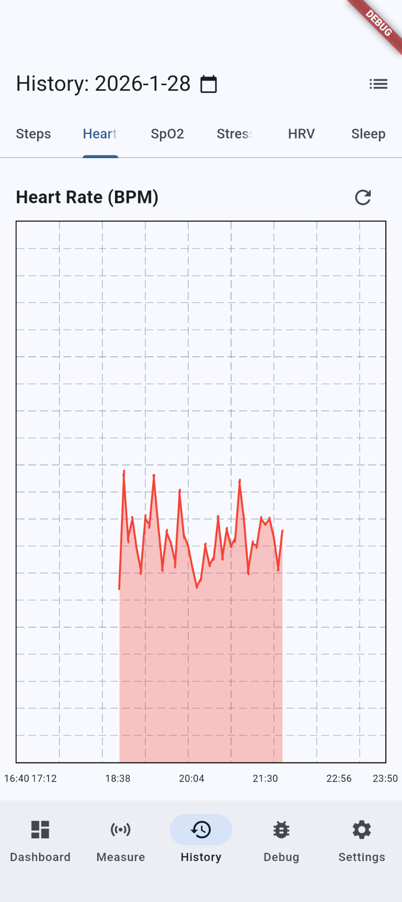

Colmi R12 Smart Ring Companion

An unofficial, open-source alternative for the Colmi R12 and compatible Yawell protocol devices (R02, R10, etc.).

Official apps are often bloated and privacy-invasive. This companion is built with Flutter to be lean, transparent, and focused on giving you access to your own data.
✨ Features

    🎯 Targeted Pairing: Filters for R12/R02/Rxx devices so you don't have to scroll through your "smart" thingies.

    📊 Live Stats: Real-time monitoring for Heart Rate, SpO2​, HRV, and Stress.

    💾 Data Sync: Pulls historical logs (Sleep, Steps, HR) directly from the ring's flash memory.

    🛠️ Dev Mode: Includes a built-in HEX console to watch raw packets move in real-time—perfect for reverse-engineering.

    📱 Cross-Platform: High-performance UI running on Android and (hopefully) iOS.

## 📸 App Preview

| Dashboard | Settings | History |
| :---: | :---: | :---: |
|  |  |  |

🛠️ Tech Stack

    Framework: Flutter / Dart

    Bluetooth: flutter_blue_plus

    State Management: Provider

    Protocol: Custom implementation of the Yawell UART protocol (BlueX chipset).

🚀 Getting Started
📦 Quick Start (Binary)

Don't want to build from source? Grab the latest build here:
[Download from pCloud](https://e.pcloud.link/publink/show?code=kZ8P9aZgbt0ntiX9U76pWP4QRJwIbJkGHfX) 

💻 Dev Setup

Prerequisites: Flutter SDK (3.0+) and a physical device (Bluetooth functionality is not available on emulators).

    Clone the repo:
    Bash

    git clone https://github.com/SneakyZippy/colmi_r12_flutter_companion.git
    cd colmi_r12_flutter_companion

    Fetch dependencies:
    Bash

    flutter pub get

    Launch:
    Bash

    flutter run

⚠️ Requirements & Permissions

    [!IMPORTANT]
    Android: Requires Android 12+. Ensure BLUETOOTH_SCAN and BLUETOOTH_CONNECT are in your manifest. Location Services must be toggled ON for scanning to work.

    iOS: Ensure Info.plist includes the NSBluetoothAlwaysUsageDescription key.

🤝 Credits

This project stands on the shoulders of giants in the reverse-engineering community:

    tahnok/colmi_r02_client - The blueprint for packet structure.

    CitizenOneX/colmi_r06_fbp - Insights into Dart stream handling.

    Gadgetbridge - The ultimate reference for BLE command sets.

Disclaimer: This is a hobby project and is not affiliated with Colmi or Yawell. Use at your own risk. This is not a medical device.
